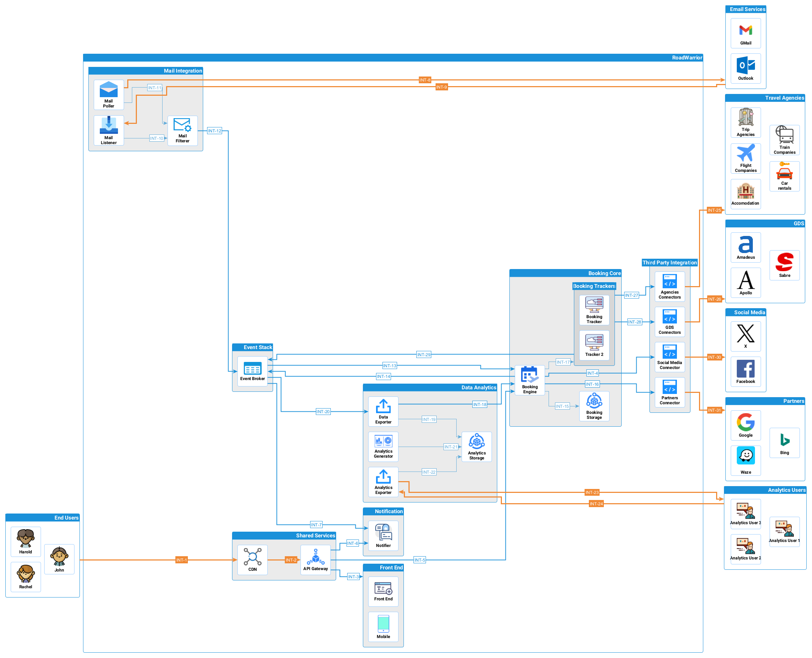

# O'Reilly Architecture Katas 2023 - ArchEnemies

<!-- vim-markdown-toc GFM -->

- [Members](#members)
- [Mission The Road Warrior](#mission-the-road-warrior)
  - [Challenge](#challenge)
- [Approach](#approach)
  - [Actor/Action](#actoraction)
- [Architecture](#architecture)
  - [Overview](#overview)
  - [Analysis](#analysis)
  - [ADR](#adr)
  - [C4 Modeling](#c4-modeling)
  - [End to End](#end-to-end)
    - [Service stack interaction overview](#service-stack-interaction-overview)
    - [Full component interaction](#full-component-interaction)
  - [Architectural Fitness](#architectural-fitness)
- [Deployment](#deployment)
- [Use cases](#use-cases)
- [References and credits](#references-and-credits)

<!-- vim-markdown-toc -->

## Members

- Alvaro Salvador [LinkedIn](https://www.linkedin.com/in/alvarorafael/)
- Anand Bajpai [LinkedIn](https://www.linkedin.com/in/bajpai-anand)
- Constantine Korobov [LinkedIn](https://www.linkedin.com/in/ckorobov/)
- Mirco Paccusse [LinkedIn](https://www.linkedin.com/in/mirco-paccusse-97525012/)
- Sergiy Shelekh [LinkedIn](https://www.linkedin.com/in/proxitrone/)

## Mission The Road Warrior

> A new startup wants to build the next generation global online trip management dashboard to allow travelers to see all of their existing reservations organized by trip either online (web) or through their mobile device. Build a sustainable architecture for same.

### Challenge

- [Problem statement](./doc/problem.md)
- [Additional Clarifications](./doc/clarification.md)
- [Glossary](./doc/glossary.md)

## Approach

We follow actor/action model to begin with. We identify the actors and actions they need to perform. We, then, create components which will enable actors to perform specific actions. Next, we find interactions among actors. This provides us high level view of actors components required in the system, their relation to stakeholders and their (inter)dependency.

We create use case diagrams to visualize the functional requirements to assists us making design choices and understanding the system on more granular level.

Now we understand the desired system behavior better so we qualify the requirements to identify architecture characteristics. These characteristics help us identify the most suitable architecture style for the solution.

We use C4 model technique to design the architecture, starting with most abstract view of the system and going further in details in each step.

We use ADR approach to make a informed decision for all important architecture decisions.

### Actor/Action

<b>First iteration</b>

 

<b>Second iteration</b>

## Architecture

> This exercise is primarily focused on defining the architectural style and structure of the system. While we acknowledge the critical importance of **security**, **access management**, **high availability**, **encryption**, **GDPR** and **backup** in the overall system design, these aspects are not within the scope of this proposal. Our intention is to first establish the architectural foundation, and subsequently, these implicit aspects will be addressed in a separate, dedicated effort.

### Overview

### Analysis

- [Identify architecture characteristics](./doc/arch-char.md)
- [Identify deserving architecture style(s)](./doc/arch-style.md)
- [Component Index](./doc/components.md)

### ADR

- [Space based architecture style](/doc/adr/0001-arch-style-space-based.md)
- [Microservices vs Event driven architecture style](/doc/adr/0002-arch-style-microservices-vs-event-driven.md)
- [Dedicated storage for analytics](/doc/adr/0003-dedicated-db-for-analytics-usage.md)
- [Storing agency contact details for help](/doc/adr/0004-store-agency-contact-for-help.md)
- [One Analytics Generator for yearly user report and other analytics](/doc/adr/0005-data-reporter-and-analytics-generator.md)
- [Analytics generator and Analytics exporter](/doc/adr/0006-analytics-generator-and-analytics-exporter.md)
- [Efficiency oriented algorithm for booking tracker](/doc/adr/0007-efficient-oriented-algorithm-for-booking-tracker.md)
- [Deploying system in cloud or on premise](/doc/adr/0008-deploying-system-in-cloud-or-on-premise.md)

### C4 Modeling

> The C4 model is an "abstraction-first" approach to diagramming software architecture, based upon abstractions that reflect how software architects and developers think about and build software.

* [Context](doc/c4/context.md)
* [Container](doc/c4/container.md)
* Components
  * [Booking Core](doc/c4/component-booking-core.md)
  * [Mail integration](doc/c4/component-mail-integration.md)
  * [Notifier](doc/c4/component-notifier.md)
  * [Analytics](doc/c4/component-analytics.md)
  * [Front End](doc/c4/component-front-end.md)
  * [Agency collector](./doc/c4/component-collector-agencies.md)

### End to End

Below is presented in detail the different interactions identified within the component architecture.

#### Service stack interaction overview

<b>User Access Stack</b>

 

<b>Booking Core</b>

 

<b>Data Analytics</b>

 

<b>Event Stack</b>

 

<b>Mail Stack</b>

 

<b>Third Parties Stack</b>

 

#### Full component interaction

<b>Interaction matrix</b>

| Id | From Component         | To Component                      | Interaction type      | Communication Domain                                       | Observations                                              |
| ------:                                                   | --                     | --                                | --                    | --                                                         | --                                                        |
| **INT-1**                                                 | End Users              | CDN                               | HTTP                  | PUBLIC                                                     | Cached on CDN                                             |
| **INT-2**                                                 | CDN                    | API Gateway                       | HTTP                  | PUBLIC                                                     | Refresh content                                           |
| **INT-3**                                                 | API Gateway            | Front End                         | HTTP                  | PLATFORM INTERNAL                                          |
| **INT-4**                                                 | Booking Engine         | Social Media Connector	REST      | PLATFORM INTERNAL     |
| **INT-5**                                                 | API Gateway            | Booking Engine                    | HTTP / Streaming      | PLATFORM INTERNAL                                          |
| **INT-6**                                                 | API Gateway            | Notifier                          | HTTP / REST           | PLATFORM INTERNAL                                          |
| **INT-7**                                                 | Event Broker           | Notifier	Streaming         | PLATFORM INTERNAL     |
| **INT-8**                                                 | Mail Poller            | Email Services                    | HTTP / IMAP / POP3    | PUBLIC                                                     | Active polling                                            |
| **INT-9**                                                 | Email Services         | Mail Listener	SMTP              | PUBLIC                | Passive reception                                          |
| **INT-10**                                                | Mail Listener          | Mail Filterer	Streaming         | STACK INTERNAL        | Postprocess and filter emails which shall trigger an event |
| **INT-11**                                                | Mail Poller            | Mail Filterer	Streaming         | STACK INTERNAL        | Postprocess and filter emails which shall trigger an event |
| **INT-12**                                                | Mail Filterer          | Event Broker	Streaming         | PLATFORM INTERNAL     | Generate events based on mail filtering logic              |
| **INT-13**                                                | Event Broker           | Booking Engine	Event push        | PLATFORM INTERNAL     |
| **INT-14**                                                | Booking Engine         | Event Broker	Event pull        | PLATFORM INTERNAL     |
| **INT-15**                                                | Booking Engine         | Booking storage                   | HTTP / REST / GraphQL | STACK INTERNAL                                             | CRUD operations                                           |
| **INT-16**                                                | Booking Engine         | Partners Connector	REST      | PLATFORM INTERNAL     | Request context data for a booking                         |
| **INT-17**                                                | Booking Engine         | Booking Trackers	REST      | STACK INTERNAL        | Create tracker tasks                                       |
| **INT-18**                                                | Data Exporter          | Booking Engine	REST / GraphQL    | PLATFORM INTERNAL     | Read / Import data for analytics                           |
| **INT-19**                                                | Data Exporter          | Analytics Storage	Streaming | STACK INTERNAL        | Store data for analytics                                   |
| **INT-20**                                                | Event Broker           | Data Exporter	Streaming         | PLATFORM INTERNAL     | Booking events relevant for analytics                      |
| **INT-21**                                                | Analytics Generator    | Analytics Storage	Streaming | STACK INTERNAL        | Import and generation of reports                           |
| **INT-22**                                                | Analytics Exporter     | Analytics Storage	Streaming | STACK INTERNAL        | Read analytics and reports                                 |
| **INT-23**                                                | Analytics Exporter     | Analytics Users	Streaming         | PUBLIC                | Expose analytics and reports                               |
| **INT-24**                                                | Analytics Users        | Analytics Exporter                | HTTP / REST / GraphQL | PUBLIC                                                     | Consume analytics and reports                             |
| **INT-25**                                                | Agencies Connectors    | Travel Agencies                   | HTTP / REST           | PUBLIC                                                     | Retrieve booking status                                   |
| **INT-26**                                                | GDS Connectors	GDS    | HTTP / REST                       | PUBLIC                | Retrieve booking status                                    |
| **INT-27**                                                | Booking Trackers       | Agencies Connectors	REST      | PLATFORM INTERNAL     | Request booking status update                              |
| **INT-28**                                                | Booking Trackers       | GDS Connectors	REST              | PLATFORM INTERNAL     | Request booking status update                              |
| **INT-29**                                                | Booking Trackers       | Event Broker	Streaming         | PLATFORM INTERNAL     | Booking event                                              |
| **INT-30**                                                | Social Media Connector | Social Media                      | HTTP / REST           | PUBLIC                                                     | Share booking info                                        |
| **INT-31**                                                | Partners Connector     | Partners                          | HTTP / REST           | PUBLIC                                                     | Get complementary info to support location based features |

 

### Architectural Fitness

[Implement Architectural Fitness Functions](./doc/arch-fitness.md)

## Deployment

- [Guidance on system deployment](./doc/deployment.md)
- [Recommendation on product rollout](./doc/rollout.md)

## Use cases

- [User adds booking manually](./doc/use_cases/user_add_booking_manually.md)
- [Booking added via email scan](./doc/use_cases/booking_added_via_email_scan.md)
- [User shares trip information in social media](./doc/use_cases/user_share_trip_on_social_media.md)
- [User shares trip information with other user(s) ](./doc/use_cases/user_share_with_other_user.md)
- [User request help to remediate a booking incident](./doc/use_cases/user_request_help.md)
- [Agency updates booking status](./doc/use_cases/agency_updates_booking_status.md)
- [User personal yearly reports](./doc/use_cases/user_yearly_report.md)
- [Data analytics and information access](/doc/use_cases/analytics_and_reporting.md)
- [Rich user experience based on time and/or geolocation info](./doc/use_cases/rich_user_experience.md)

## References and credits

Though it is not possible to mention every source material we were benefitted from, while working on this solution, we would lile to mention following as noteworthy

1. [Developer to Architect](https://www.developertoarchitect.com/)
2. [Fundamentals of Software Architecture](https://www.oreilly.com/library/view/fundamentals-of-software/9781492043447/)
3. [Software Architecture Patterns](https://www.oreilly.com/library/view/software-architecture-patterns/9781491971437/)
4. [O'Reilly Software Architecture Kata Entries](https://github.com/tekiegirl/SoftwareArchitectureResources/blob/main/Resources/OReillyKata.md)
5. [C4 Model](https://c4model.com/)
6. [Software Architecture: The Hard Parts](https://learning.oreilly.com/library/view/software-architecture-the/9781492086888/)
7. [Freepik](https://www.freepik.com/)
