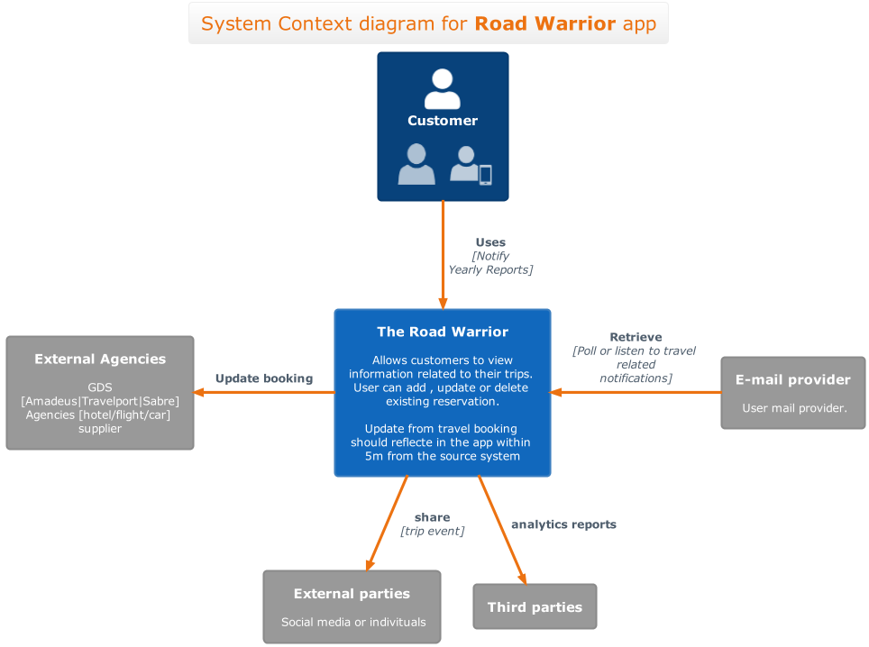
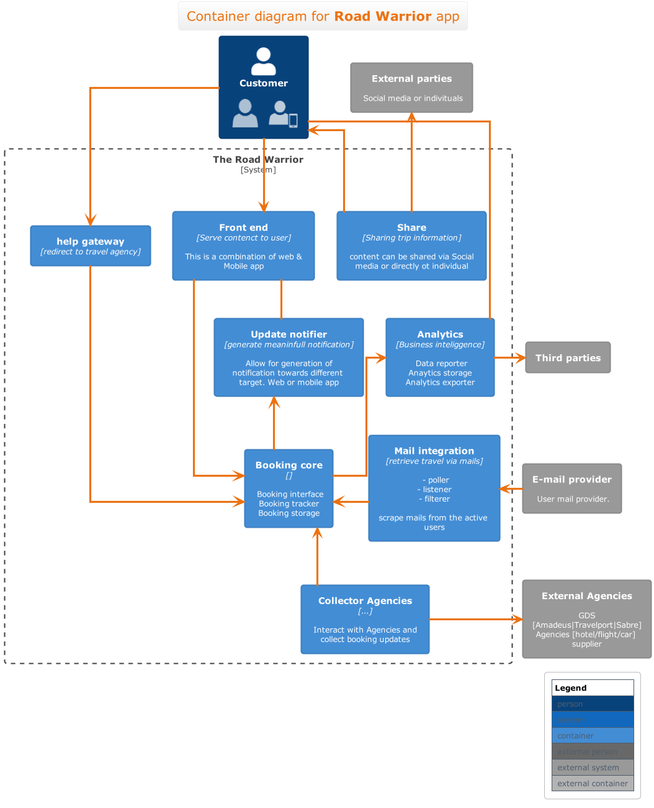
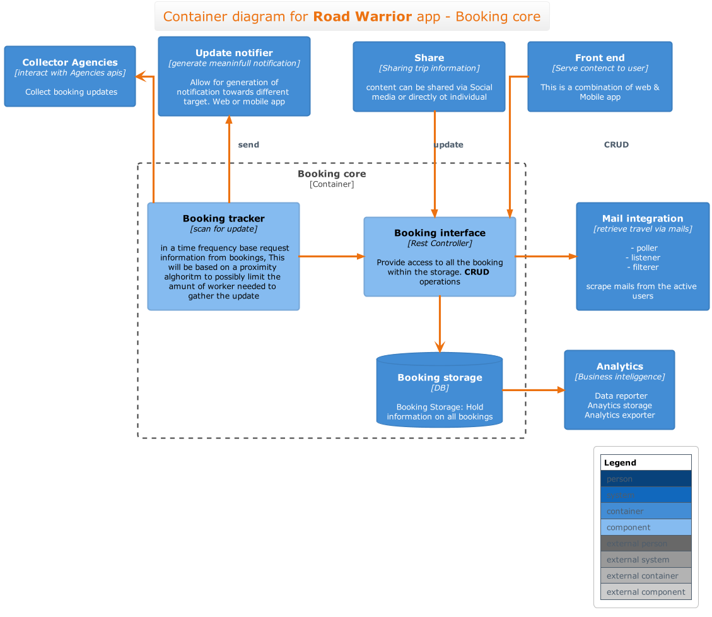
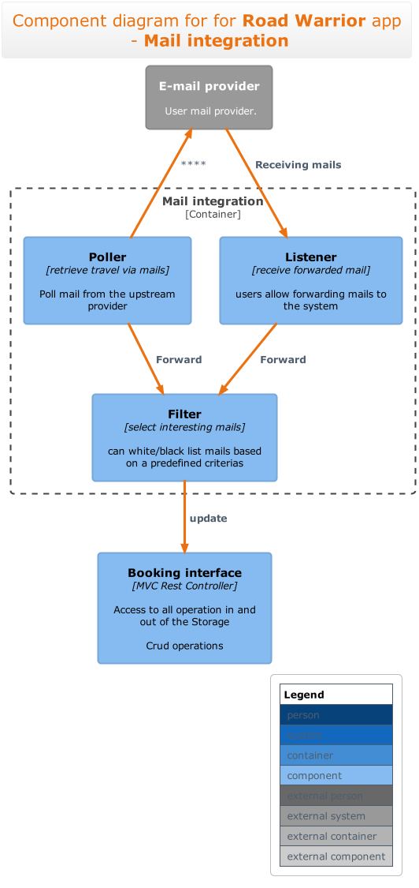
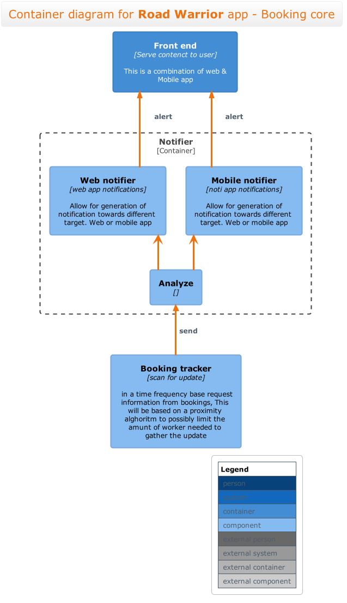
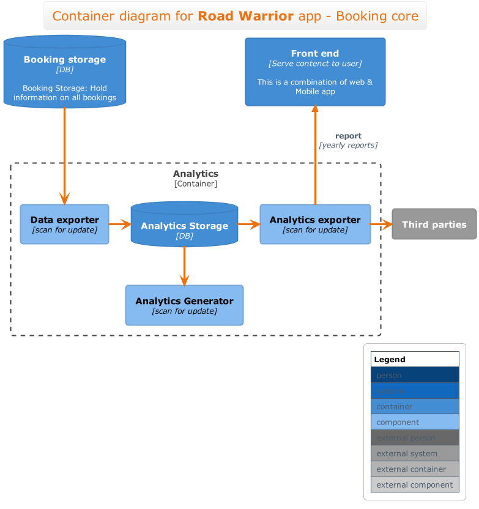
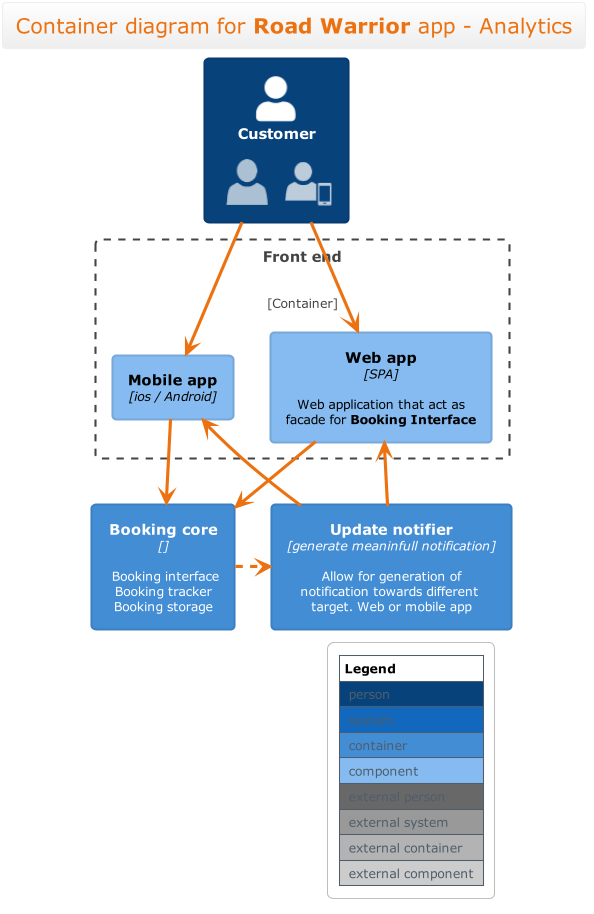

# Temporary

keeping this to show the diagrams

context

container

 

## Component Booking Core

## Component Mail integration

## Component Notifier

## Component Analytics

## Component Front End

