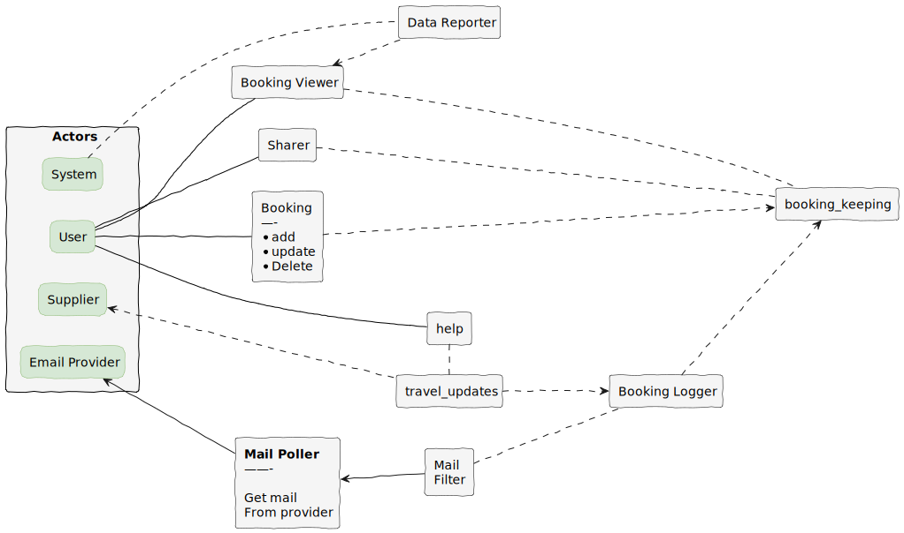
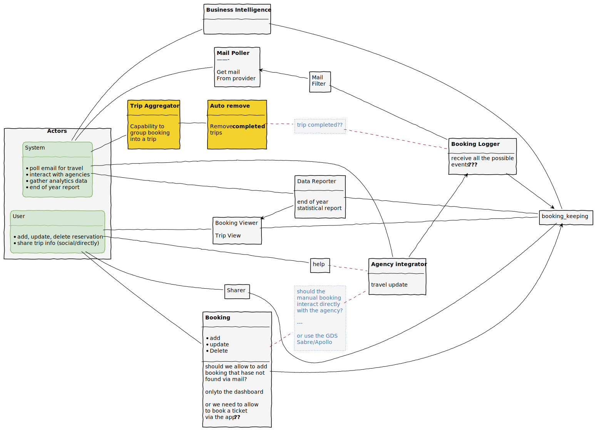
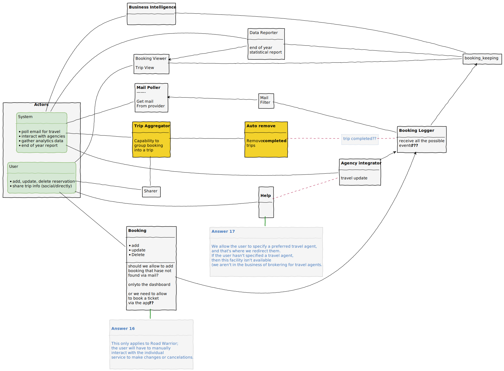
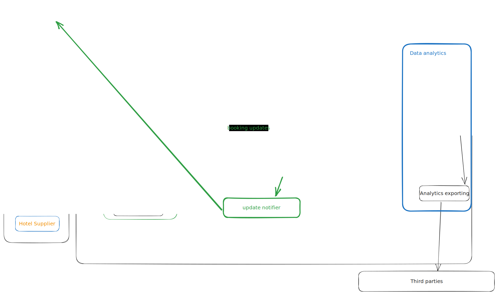
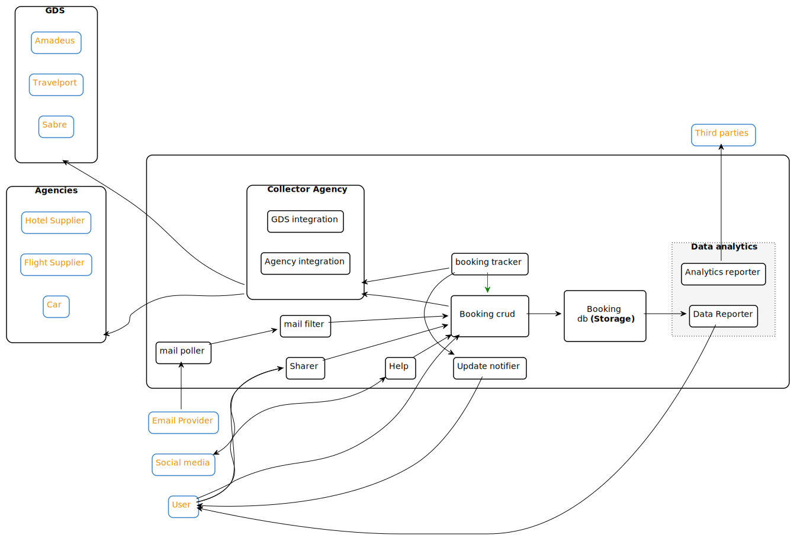

# Domain analysis

## 2023-09-12


<details><summary>PUML first meeting</summary>

```
@startuml firstMeeting
skinparam handwritten true
hide stereotype

left to right direction

'skinparam linetype ortho

skinparam rectangle{
    BackgroundColor WhiteSmoke
    borderColor black
    LineColor<<actor>> #86B56B
    borderColor<<actor>> #86B56B
    BackgroundColor<<actor>> #D6E8D5
    LineColor<<actor>> #D6E8D5
    RoundCorner<<actor>> 15

    borderColor<<action>> #3F75BB
    FontColor<<action>> #3F75BB
    BackgroundColor<<action>> #FFE5CC
'    RoundCorner<<action>> 30

    BackgroundColor<<sticky>> #F3D22B
    borderColor<<sticky>> black
 }


rectangle Actors {

    rectangle system  <<actor>> [
    System
    ]
    rectangle user <<actor>> [
    User
    ]
    rectangle supplier <<actor>>[
    Supplier
    ]
    rectangle email_prvider <<actor>> [
    Email Provider
    ]
}

' position actors
'
user                 .[hidden]                      system       
supplier             .[hidden]                      user         
email_prvider        .[hidden]                      supplier     


' action

rectangle mail_poller [
**Mail Poller**
——-

Get mail 
From provider
]

rectangle mail_filter [
Mail
Filter
]

rectangle booking_logger [
Booking Logger
]

rectangle travel_updates

rectangle booking_manual [
Booking
—-
* add
* update
* Delete
]

rectangle sharer  [
Sharer
]

rectangle help 

rectangle booking_viewer  [
Booking Viewer
]

rectangle booking_keeping 

rectangle data_reporter  [
Data Reporter
]

booking_viewer            .[hidden]               sharer
sharer                    .[hidden]               booking_manual
booking_manual            .[hidden].               help

' Links 
user -[#black]-- sharer
user -[#black]-- booking_viewer
user -[#black]-- booking_manual
user -[#black]-- help


supplier <... travel_updates

email_prvider <--- mail_poller

system .... data_reporter

'
' connectivty intermediate
booking_viewer   <..    data_reporter
'
help             .      travel_updates
booking_viewer   ...    booking_keeping
booking_manual   ...>   booking_keeping
sharer           ...    booking_keeping
'
mail_poller      <--    mail_filter

booking_logger   ..>    booking_keeping
'
'
mail_filter      ...    booking_logger
travel_updates   ...>   booking_logger
'
@enduml
```

</details>





## Questions

> Items in the dashboard should be able to be grouped by trip, and once the trip is complete, the items should automatically be removed from the dashboard

- [ ] what we see as items? single booking?
    - we can have multibooking trip
- [ ] the trip can be organized (created) by the user selecting multiple items? or should also be automatically added by mail informations?
    - example based on time of the trip and locations?

[Answers](https://docs.google.com/document/d/1xHpte5IOjMEBA39211Z3uUwl1p5yXJ7PrCGKUmTmwQE/edit?pli=1)

<details><summary>Reviewed</summary>



</details>


<details><summary>with answer</summary>



</details>


## 2023-09-13

We enhanced the design on our own and regrouped to compare. We identified following flows

1. User enters a booking into system manually
2. A booking is entered into system via email parsing
3. User shares booking via social media or with individual(s)
4. Agency changes (update schedule, cancel flight etc) booking
5. User's yearly report
6. Trip has ended
7. Third party analytics

After few hours of brainstroming we got a more precise picture



## Domain brainstom




### feedback


- workflow

### flow

source of datas
