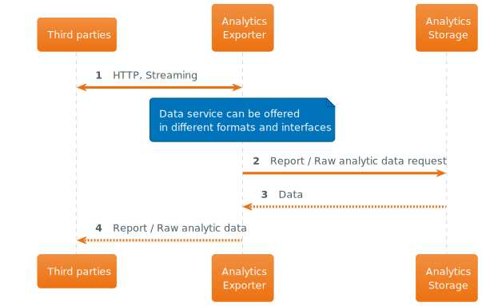

# Analytical metrics are generated and exported to 3rd parties

## Description

(Simplest use-case as a start, monthly batch data exports. Extensions: 3rd-parties can read from API, streaming metrics, dashboards, etc.)
Data analytics generator creates statistical reports on a scheduled basis and stores them in Analytics storage. Analytics exporter reads the metrics from Analytics storage and delivers them to 3rd parties.

## Interaction

### Analytics storage

Same process as described for [Yearly user reports](./user_yearly_report.md) on _Analytics Storage_ is used in order to gather and compile all the required data which can be offered to third parties.

### Consumerization of data analytics by third parties

## Observations

- Analytics monetization is a crucial point for the system, since it brings revenue for the company. Data analytics generator and Analytics storage components need to be scalable to handle ever growing amout of users, their bookings, and new types of metrics.
- Extensibility is in the foundation of the Analytics exporter component so that new ways to deliver metrics and make the 3rd parties engaged can be added.

| [🏠 home](../README.md#use-cases) |

