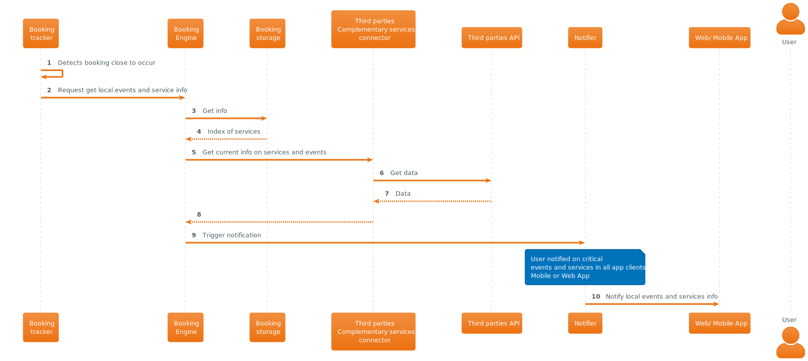

# Geolocation based features to provide rich user experience

## Description

RoadWarrior application provides end users accessory and complementary information to the registered bookings based on the geolocation reported in Mobile App and in a limited fashion on Web App. All these features which enrich the user experience based on their preferences, being always possible to opt-out or opt-in.

Some examples but not limited are.

### Local transport services advice

Report local transport and commute services available close to the location of booking in order to facilitate how to arrive or depart from them, based on the location and time values.

**Examples**

- Inform of close-by bus, subway, train stations, their timetables.
- Inform on local incidents like station not in service due to announced planned maintenance works.

### Real time traffic information

Through third party information like eg: Waze, Google... real time traffic information can be retrieved and used to provide smart advice regarding best options to reach a booking location.

**Examples**

- User just landed in airport and requires to reach hotel but due to traffic condition RoadWarrior app recommends to avoid commuting with car or bus transport and instead suggest other available options like subway, train...
- Due to known road maintenance works app reports avoid to use it when reaching destination if car rental is part of bookings.

### Smart notifications to friends, family or colleagues

In case of disruptive events registered on tracked bookings end user may opt to have a proactive notification to some contacts in order to report about the incident proactively or reactively. The notification can be triggered under certain circumstances based on location and time.

**Examples**

- Due to flight delayed user lands late in airport at night and in context with a hotel booking RoadWarrior app suggest to the user if a notification shall be sent to the hotel reporting late arrival to acknowledge still on track to arrive.
- User add some company colleagues contact information, which are going to pick them at the airport in order to send a _I am late_ smart notification with booking delayed info, if the platform detects based on location, time and booking delay info that the user is not close or online at destination.

### Airport/Train station local services information

Based on information retrieved programmatically and proactively from transport and service providers user will receive context information regarding events and services relevant with the booking information at the stations.

**Examples**

- User receives information on which baggage belt expect their checked-in luggage based on time and its location within airport.
- Information regarding restaurants and other services is reported to the user based on its location and time when already in the station and already checked-in. Based on time may suggest where to take coffe and have breakfast, or lunch, dinner...

### Sport and recreation

End user will receive information of options based on location for sport and recreation activities if user has set to be proactively advised on it. This supports sportive type user profiles which no matter where they are they want to keep their usual sport activities being informed of places where to maintain their favorite sport activity or discipline.

**Examples**

- Corporate user likes to jog or run no matter if they are travelling and receives suggestions on green areas, parks available nearby hotel, and their open hours if applicable.

### Social media based info

Through third-parties user receives recommendation of nearby places to a booking location where they are actively located, with enriched information with opinions of users on social media. Based on time it may enrich or target information regarding restaurants, bars...

**Examples**

- User currently at hotel close to diner time receives suggestions with ratings of nearby restaurants with links to the business or social media where detailed opinions are published.

### Emergency contact

Feature allow users to predefine one or more emergency contacts to be reached with details of active bookings and geolocation if the user triggers a emergency contact request.

**Examples**

- User has a car accident on a rented car and reports with a single button its location, details of the trip to their family, couple or close friend for awareness with short message.

## Interaction

### Programmatic store of local services index info

The platform programmatically triggers the retrieval and store of index information of quite often used services and/or locations in context with bookings, to support geolocation based features. This information is minimal covering only data regarding the geolocation of services, stations, etc, and its third party API provider. This information is stored in the Booking storage and related, so when a request for current services and events is processed by the Booking Engine it is available in order to locate the relevant Third party connectors required to be used, eg: agencies, GDS, social media, other providers.

### Proactive notification of local meaningful events

This interaction may use optionally geolocation information if available, although it may happen programmatically even if this information is not available. It allows the platform to gather local services and events information in context with the known location where a booking event it's close to occur time wise. Eg: flight about to land and retrieve info on baggage belts where to expect luggage if checked-in, info of local transport options, car traffic information.

### Geolocation based information

This interaction covers the sequence when either the Mobile or Web App transparently based on the current geolocation info and its proximity towards a relevant Point of Interest in context with their bookings, requests current information regarding local services and events.

| [🏠 home](../../README.md#use-cases) |

