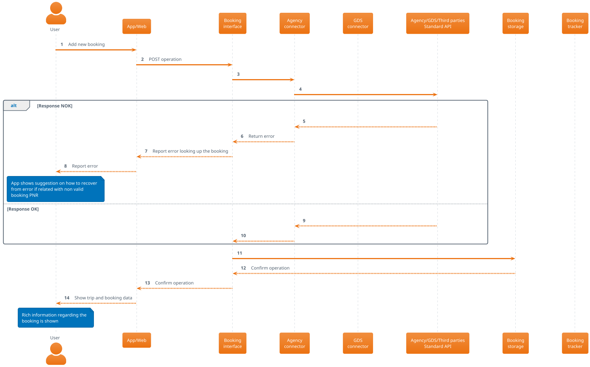
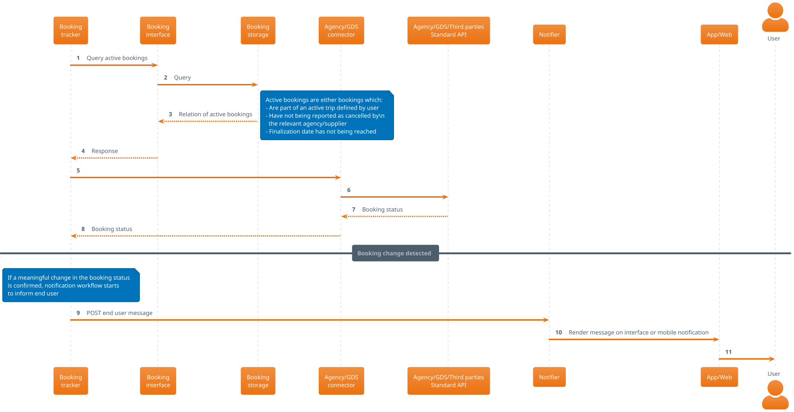

# User adds manually a booking into the system

[[_TOC_]]

## Description

End user uses mobile app or public web interface and adds manually a booking PNR which has been already arranged upfront by the user. This new booking will be set by the user as part of an existing or new trip which will be shown in the dashboard and tracked.

## Interactions

### Booking addition

### Booking tracking

