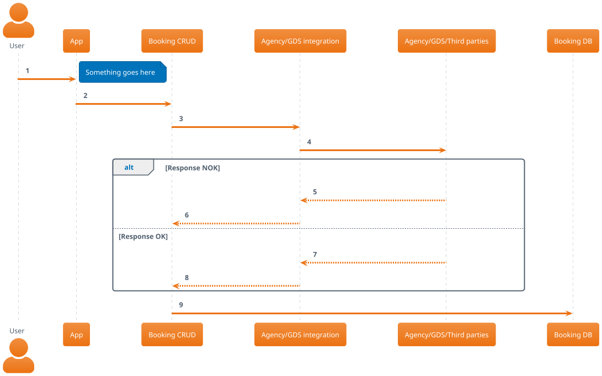

# Manual booking use case

## Description

## Interaction

```plantuml
@startuml user_add_booking_manually
!theme aws-orange

skinparam BackgroundColor white
skinparam actorstyle awesome
autonumber 1

actor "User" as user
participant "App" as app
participant "Booking CRUD" as booking_crud
participant "Agency/GDS integration" as agency_int
participant "Agency/GDS/Third parties" as third_parties
participant "Booking DB" as booking_db

user -> app
note right
Something goes here
end note
app -> booking_crud
booking_crud -> agency_int
agency_int -> third_parties
alt Response NOK
   third_parties --> agency_int
   agency_int --> booking_crud
else Response OK
   third_parties --> agency_int
   agency_int --> booking_crud
end

booking_crud -> booking_db
@enduml

```

