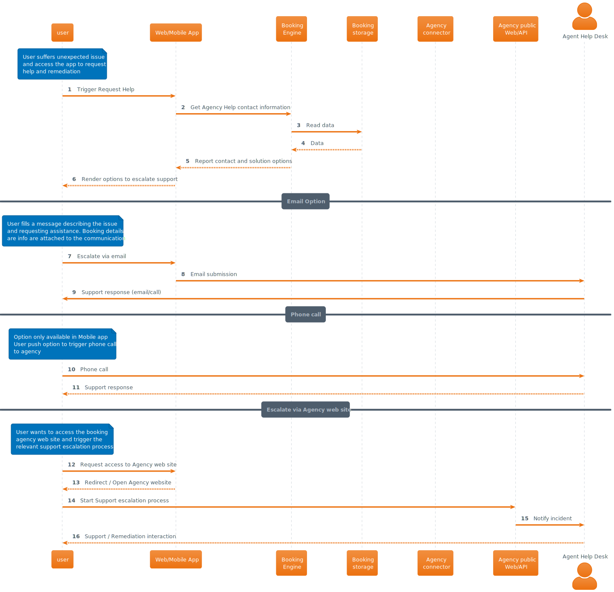

# User request help to external agency

## Description

User has suffered and unexpected issue regarding one of his bookings and requires contact quickly the agency supporting the booking in order to request help and remediation. RoadWarrior application provides functionality to arrange this quickly and smoothly from the Web or Mobile app facilitating reaching the agency via email, phone call or redirecting to the public web site of the external agency.

## Interaction

RoadWarrior platform offers different solutions to facilitate getting help from the relevant external agency supporting the booking. Up the capabilities provided by the agency in context with the booking, we can offer:

- Facilitate contact information
- Send email communication attaching transparently to the user all the relevant details of the booking impacted by the incident
- Arrange direct phone call to the agency from the Mobile application.
- Redirect end user to the public website of the agency to trigger the incident reporting. If the external agency API supports it RoadWarrior application may lookup and prefill and locate on behalf of the user any booking data required to support the process, offloading this from the user.

All the previous can be run by the user up the capabilities offered by the agency.

| [🏠 home](../../README.md#use-cases) |

