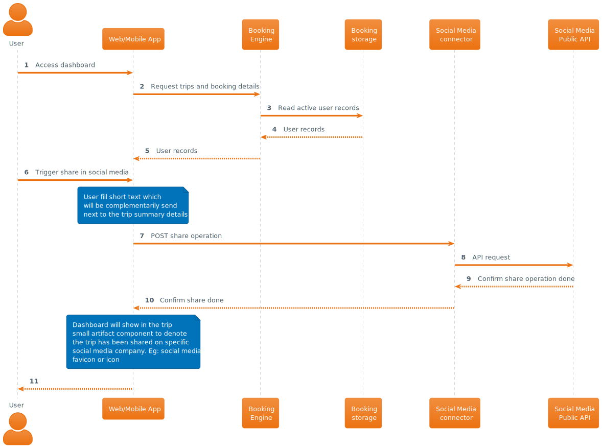

# User share trip information in social media

## Description

End user has already a trip managed in the RoadWarrior app dashboard and would like to share some of its details with some work colleagues or friends in social media.

## Interaction

## Observations

### Security

_**Social media connector**_ implements security logic to filter out any personal or sensitive information which may be part of booking details.

| [🏠 home](../../README.md#use-cases) |

