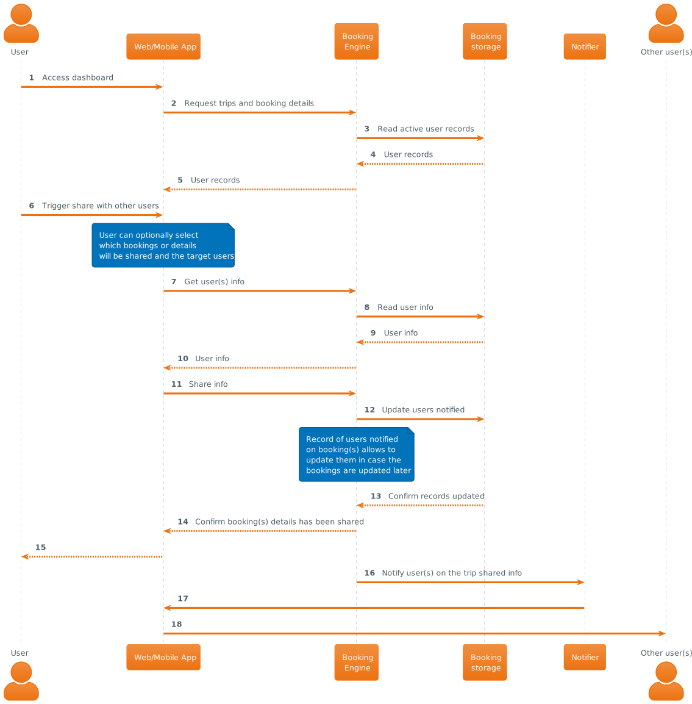

# User shares trip information with other user(s)

## Description

End user shares trip information with other users in the platform, eg: to share with some work colleagues which are traveling together the hotel and/or flight chosen.

## Interaction

## Observations

End user(s) which has received info of trip/booking from another end user can be set optionally by the user originating the info to be subscribed to any change(s) on the booking status. This can allow users to keep track of meaningful changes on them like eg: change of hotel, flight cancellations...

| [🏠 home](../README.md#use-cases) |

