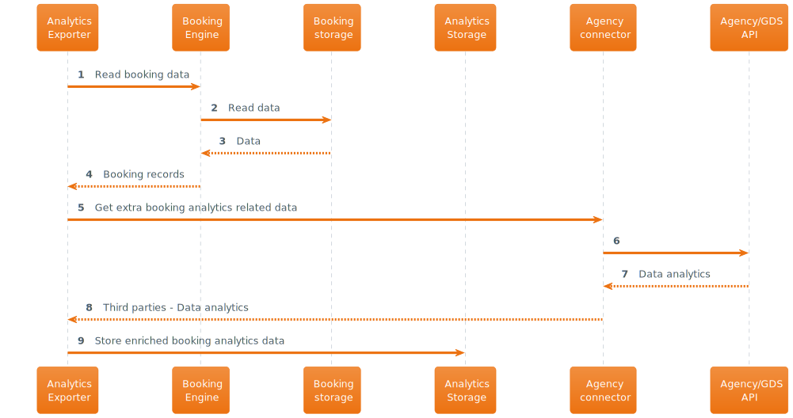

# Yearly report is generated and sent to a user

[Home](../../README.md#use-cases)

## Description

Data analytics generator creates yearly statistical reports (agregated metrics and views on user data) on a scheduled basis (for all users who need the report before next schedule: weekly/daily) and stores them in Analytics storage. Analytics exporter reads the report from Analytics storage and delivers the report to a user via front-end (and email).

## Interaction

### Analytics storage

Below described high level interaction process to gather required data to support the generation of yearly reports for the users. This process takes care of programmatic export and storage of data into a dedicated analytics datalake which support all reports and analytics consumption.

### User report generation on-demand

User on demand may request yearly generated reports via the Web/Mobile App.

### Yearly report notification

Proactive notification is submit to end users of the platform once a year has passed since the user has signed up in the platform, and the relevant yearly report has been made available.

The user will receive a notification via email and on the Web/Mobile application facilitating the access to the report and inviting to explore different highlighted aspects of their activity through the year reported.

## Observation

- Yearly reports help keep users engaged and understand the value that the RoadWarrior brings them. These reports are displayed as graphs and summaries in the front-end (web/app), and notifications can be sent on the availability as well.
- In this use-case, analytics storage is scalable to handle the growing number of users and Data analytics generator needs to have a certain degree of elasticity, which can be anticipated since the date of registration for a user is known and stored in the system.
